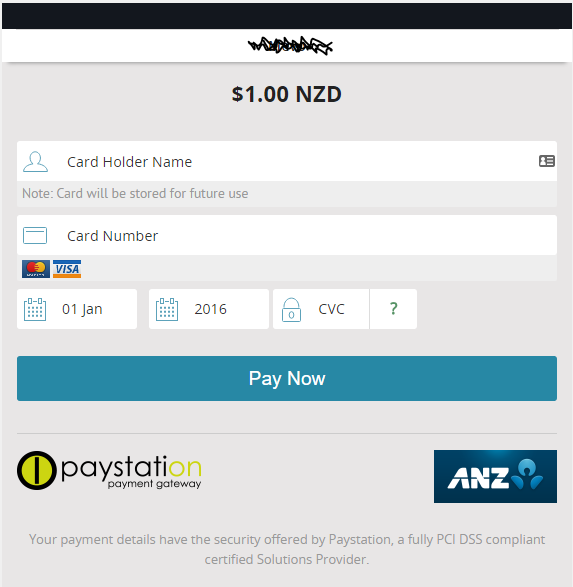

# What You Need to Provide

Setting up a new car sharing business can be complicated. There is much to think about besides having a web site and some cars. 
You are going to need to run a legitimate company in your geography, and worry about things like: Terms Of Service, Privacy Policies, Tier1 Support, Marketing, Social Media, etc.

One of the things you are going to get (see [What Is In The Box](inthebox.html)) is a cloud tenancy on the Hourfleet platform with your own app for your customers. While the Hourfleet platform provides many of the online tools to help manage your customers and operate your car sharing, you are still going to need to sort out some commericial relationships with supporting businesses so that the platform automate most of the work for you.

These are some of the things that you need to do:

* Create a Merchant Account with your Bank
* *[New Zealand Network Operators]* - Create a PayStation account that can charge your customers credit card and remit to your merchant bank account
* *[New Zealand Network Operators]* - Create a RunTheRed account, so that your customers can receive SMS TXT message alerts, and so that your cars can be operated remotely (keyless-access).
* Construct a Terms Of Service agreement with your Lawyers
* Create a Privacy Policy with your Lawyers
* Create a 'front door' website to inform and capture your customers, and that can lead your customers to register and use cars in your network.

# Paystation Account
*[New Zealand Network Operators Only]*
Once you have secured a Merchant Bank account, you can create an account with [www.Paystation.co.nz](www.Paystation.co.nz).
You will need to create an account that gives you the ability to charge your customers credit cards, and make payments into your bank account.

Hourfleet integrates with Paystation to collect and verify your customer's credit cards, using what is called a *3-party with tokenisation*. 

To get started you need to follow the [Getting Started](http://www.paystation.co.nz/how_to_get_started) process outlined by Paystation.

As part of that process you will need to fill out the onboarding form. On that form you will see a section called: "Software Integrator". You will need to put the following Details:

Hourfleet does not capture nor store credit card information. Instead, Hourfleet hosts (in a web page iframe) a Paystation credit card form that Paystation provides, and all credit card details from your customers are handled directly by Paystation. Hourfleet then stores a token which is then used to charge your customers credit card, when you bill them. 

PCI-DSS (Payment Card Industry Data Security Standard) is the set of rules that govern how businesses should handle customer credit card information, and Paystation is fully PCI compliant.

In addition to filling out the paper form, by either phone or email, you will need to request from Paystation that they turn ON the "Hosted Responsive Format". This is Paystation's version of the credit card entry form that scales well for the web app when viewed on a mobile phone. Without it, the Paystation form is hard for mobile users to enter their credit card information. It looks like this:

Once you have created your Paystation account, Hourfleet requires that you provide the following information for your tenancy:

* GatewayId
* ApiKey

These details are provided to you by Paystation after creating your account.

You also need to tell Paystation the URL's for them to send payment confirmations to your tenancy:
These are:

* Return URL: https://yourtenancy.hourfleet.com:4431/api/payments/gateway/cards/confirmation
* POST URL: https://yourtenancy.hourfleet.com:4432/api/payments/gateway/cards

When a payment fails, Hourfleet will know about it, but Paystation will also send an email to a registered email address, which you will need to provide them: for example, support@yourcompany.com

Once that is all setup, Paystation requires that you go through their "Go-Live" proceedure before your customers can start being billed. That process is outlined here: [Go Live Proceedure](http://www.paystation.co.nz/Go-Live-Procedure)

Note: In addition to making payments to your customers through the Hourfleet web site, Paystation provides you the ability to manually charge your customers using their website. This can be handy for resolving customer issues outside the scope of what Hourfleet can do for you.

# RunTheRed Account
*[New Zealand Network Operators Only]*

Hourfleet integrates with [www.RunTheRed.co.nz](www.runthered.co.nz) as a text messaging gateway used by HourFleet for sending alerts to your customers, and instructions to the cars in your network.

You need to create your own account with RunTheRed and obtain a shortcode so that Hourfleet can use this service.
The service you are creating needs to support: Text Messaging and Delivery Receipts (DLR), but *not* Mobile Origination (MO). 

Once you have created you RunTheRed account, Hourfleet requires that you provide the following information for your tenancy:

* GatewayKey
* ShortCode
* Username
* Password

For delivery receipts to work, you need to inform RunTheRed of the we address where they must send DLR's:

* DLR URL: https://yourtenancy.hourfleet.com:4431/api/sms/status/${messageId}/update?dlr=${dlr}

RunTheRed will also provide you a login to their site ([manage.runthered.com](https://manage.runthered.com)) so that you can monitor an track all your text messages, and configure your account.
