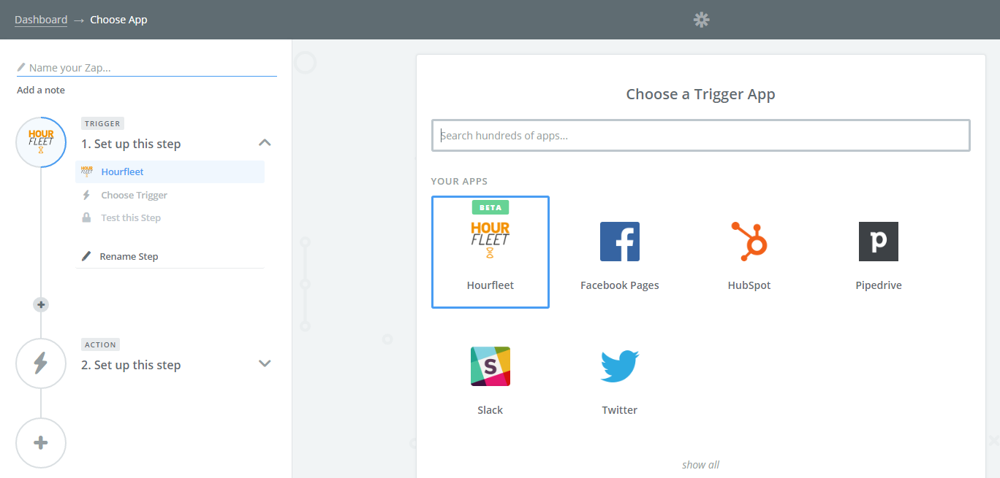
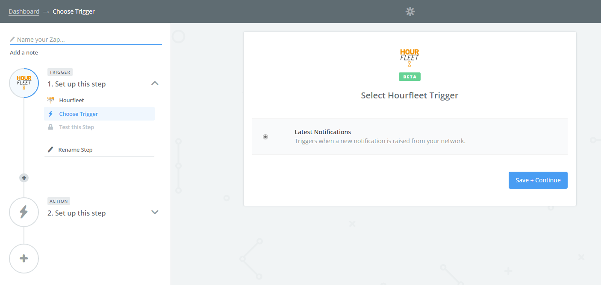
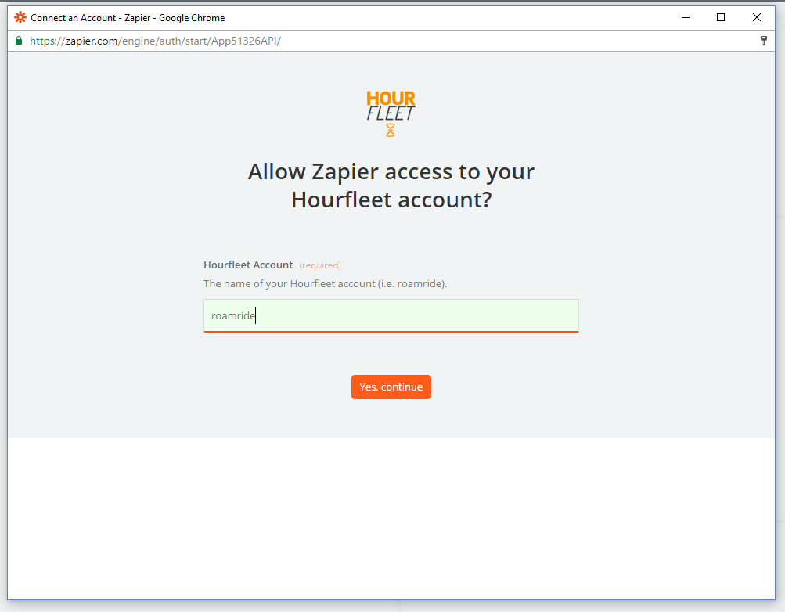
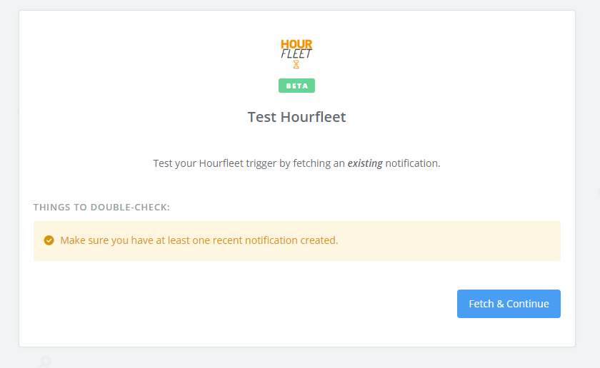
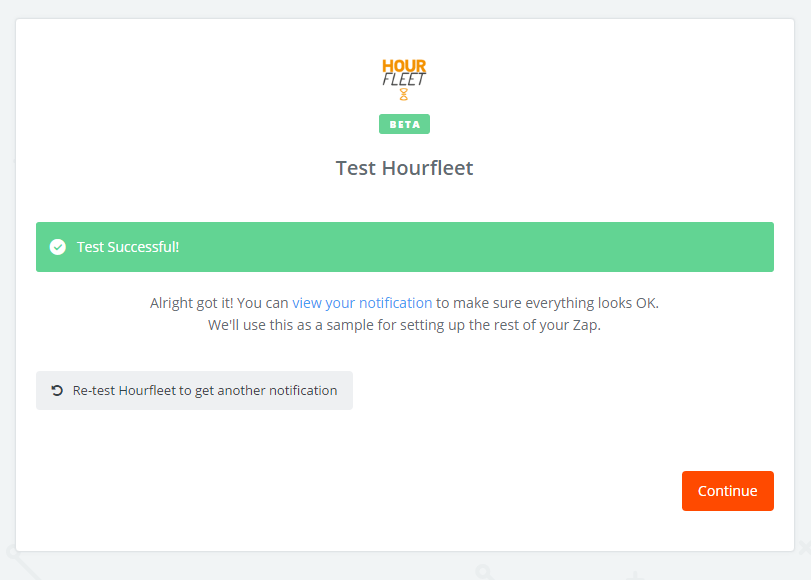
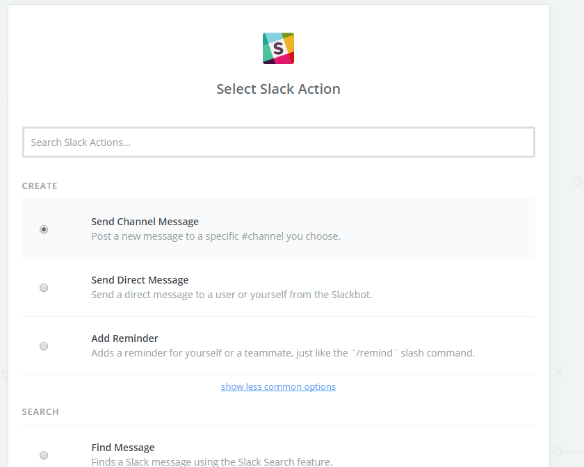

# What is Zapier?

Zapier.com is really powerful, online platform for integrating web apps with each other. 

For example, you can use Zapier to have your emails forwarded to a Slack channel or to your Facebook account.
But that is not all. There are 100's of apps that you can connect together! 

Hourfleet supports Zapier, so that means you can now get information about your car sharing network by connecting Hourfleet to your favourtie apps using Zapier!

**NOTE: At the moment, you can only get notified when the users of your network are notified of key events in the system, like when they join your network, or when they reserve or book a car.**

This is how you can set Zapier.com up to notify you through one of your favourite apps, like Slack, etc.

NOTE: We are going to show you how you can get notified of all your user's Notifications in a Slack channel of your choice. 
But don't worry, even if you don't use Slack as your messaging app, and you use another app like Intercom or just Email, you can also get notified in the same way (as long as Zapier supports your app). 

Just follow the steps below, and select the app of your choice, the rest is very similar, and within no time you will be up and running.

# Creating a Zap

## Step 1: Create a new Zap

The first thing you need to do is create an account at [zapier.com](www.zapier.com), if you already have one, then just login.

Now, we are going to create a new Zap that connects Hourfleet to send user's notifications to your favorite messaging app. 

In this case we are going to show you connecting Hourfleet to Slack, and send all user's notifications to a specific Slack channel.

## Step 2: Select the Hourfleet App

Before you can select the Hourfleet app, you will need to click on this link, and complete the invitation: [Inviation to Hourfleet](https://zapier.com/developer/invite/51326/fccef634d394c7efcb8248feb6ddb64c/)

You need to complete the invitation, because the Hourfleet app is not publically available to anyone.

** NOTE: Once you have been invited, you will need to search for the "hourfleet" app to find it.**
(Hourfleet is a private and privileged application and you will not find it listed in the Zapier directory without a search for it, and not without completing the invitation to use it.)

Simply click on the app.

## Step 3: Latest Notifications

Click the "Latest Notifications", and press "Save+Continue"

## Step 4: Your Account name

Next, you will be asked for the name of your Hourfleet account.

This is the name of your Hourfleet tenancy. (i.e. roamride)

## Step 5: Login to Hourfleet

Next you will need to login to Hourfleet.
You are going to use your account "zapier.services.appuser", and the password that you were provided for this account when you created your tenancy.

## Step 6: Authorize Zapier

Next, you will need to authorize that Zapier.com can have permission to access your data on your behalf.

If you are happy with this, then click the "Authorize" button

## Step 7: Complete App Registration

Now that Zapier is setup to access user notifications with your account, you should see the following messages to confirm and test that everything is setup correctly.

## Step 8: Configure Receiving App

Now, we need to setup the app that is going to receive the user notification. IN this case, we are going to show you setting up a Slack channel, but you can choose any app that Zapier supports to do this.

Select "Slack" from the list of apps, or search for your favourite app here.

## Step 9: Select Slack Channel

With Slack, we want to send the notification to a specific channel. So we need to select the "Send Channel Message" Action.

## Step 10: Connect to Slack Account

If you have not already logged into Zapier with your Slack account, you do that now, and press "Save+Continue"

## Step 11: Setup the Receiving App

For a slack notification, you need to tell Zapier which channel to use, and who is going to be seen to send the user's notification (i.e. whether to use a bot or not).

Then, probably the most important part is to define the "Message Text" that is going to be posted to your slack channel.

In this section, you cn create a message and substitute any of the fields that are included in a user's notification into the message. Simply select them formt eh dropdown on the right side of the "Message Text" field.

Finally save your changes. And Zapier will send a test notification to your slack channel so that you can see the result.
You can always come back and change the settings to get what you need.

